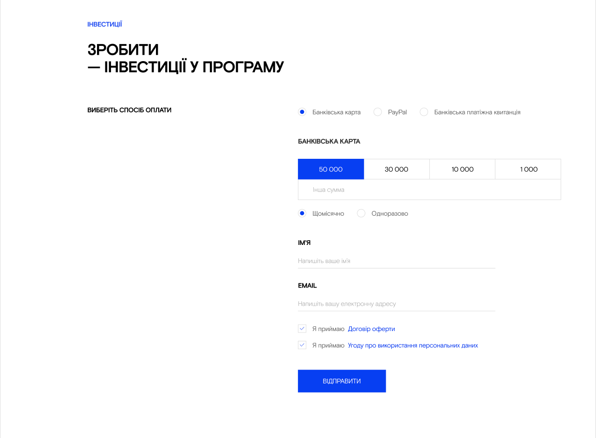

# HTML & CSS

## Домашне завдання №8

### Макет [тут](<https://www.figma.com/file/x0kSvNBxFBqDmMhgZS54JJ/Teach-for-UA_Mikhaylova_Julia-(FE_beg)?type=design&node-id=0-1&mode=design&t=8Emj2oKPH5YHcY25-0>):

Імплементуємо блок інвестиції

Макет повинен бути респонсів, добре відображатись на всіх присторях (моб і планшет і тд)

> 💡 **Порада**: Кнопки “50000”“30000”“10000”“1000” можна реалізувати групою кнопок з активним станом або застильованими радіобаттонами(де сам інпут ми приховуємо, а його лейбл стилюємо під кнопку, активний стан через :checked і якусь комбінацію селекторів наприклад input:checked + label буде вибирати лейбл, який іде після чекнутого радіобаттона)

- Врахувати структуру HTML.
- Додати всі необхідні метатеги.
- Розмітка має бути у файлі `index.html`
- Стилі мають буті у файли `style.css`
- Зображення потрібно складати у папочку images
- Результат повирнен максимально відповідати макету
- Сторінка повинна відображатись на декстопі так як зображено на макеті десктоп версії
- Сторінка повинна відображатись на телефонах читабельно за баченням розробника (моб версії макету немає)
- Повинна бути присутня форма для відправки даних
- Повинні бути реалізовані кастомні чекбокси, радіобаттони і всі інші стани
- Підключити шрифт з файлів, файли шрифтів знаходяться в архіві в './fonts/' (вже використовувався в ДЗ 6)

# Як робити завдання

- Зробіть окрему гілку для домашнього завдання: `git checkout -b homework`
- Вирішіть завдання та створіть коміт: `git commit -a -m "homework"`
- Відправте коміт до GitHub: `git push --set-upstream origin homework`
- Зробіть пул-реквест: `https://github.com/prjctr-html-css/[git-user-name]home-work-8/pull/new/homework`
